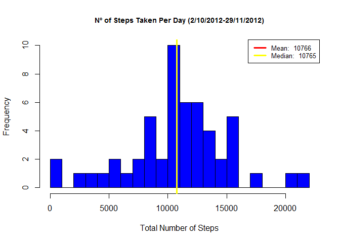

# Reproducible Research: Peer Assessment 1


## Loading and preprocessing the data


* Load the data


```r
  unzip("activity.zip")
  dat = read.csv('activity.csv', header = T)
  names(dat)
```

```
## [1] "steps"    "date"     "interval"
```

```r
  str(dat)
```

```
## 'data.frame':	17568 obs. of  3 variables:
##  $ steps   : int  NA NA NA NA NA NA NA NA NA NA ...
##  $ date    : Factor w/ 61 levels "2012-10-01","2012-10-02",..: 1 1 1 1 1 1 1 1 1 1 ...
##  $ interval: int  0 5 10 15 20 25 30 35 40 45 ...
```

```r
  head(dat)
```

```
##   steps       date interval
## 1    NA 2012-10-01        0
## 2    NA 2012-10-01        5
## 3    NA 2012-10-01       10
## 4    NA 2012-10-01       15
## 5    NA 2012-10-01       20
## 6    NA 2012-10-01       25
```

* Process/transform the data (if necessary) into a format suitable for your analysis


```r
#Data group by date
  
total<-aggregate(steps~date,data=dat,sum,na.rm=TRUE)

head(total)
```

```
##         date steps
## 1 2012-10-02   126
## 2 2012-10-03 11352
## 3 2012-10-04 12116
## 4 2012-10-05 13294
## 5 2012-10-06 15420
## 6 2012-10-07 11015
```


## What is mean total number of steps taken per day?


* Make a histogram of the total number of steps taken each day


```r
with(total,
     hist(steps,
          breaks = 20,
          main = 'Nº of Steps Taken Per Day (2/10/2012-29/11/2012)',
          xlab = 'Total Number of Steps', col = 'blue',
          cex.main = .9))
abline(v=mean(total$steps), lwd = 3, col = 'red')
abline(v=median(total$steps), lwd = 3, col = 'yellow')
legend('topright', lty = 1, lwd = 3, col = c("red", "yellow"),
        cex = .8, 
        legend = c(paste('Mean: ',    round(mean(total$steps),0)),
               paste('Median: ', median(total$steps))
               ))
```



* Calculate and report the mean and median total number of steps taken per day


```r
#Mean
mean(total$steps)
```

```
## [1] 10766.19
```

```r
#Median
median(total$steps)
```

```
## [1] 10765
```


## What is the average daily activity pattern?

* Make a time series plot (i.e. type = "l") of the 5-minute interval (x-axis) and the average number of steps taken, averaged across all days (y-axis)


```r
#Data group by interval

stepsInterval<-aggregate(steps~interval,data=dat,mean,na.rm=TRUE)

#Generate plot.
plot(stepsInterval$interval,
     stepsInterval$steps,
     type="l",
     col="red",
     main='Average Steps by Time Interval (5 minutes)',
     xlab= '5 Minute Time Interval',
     ylab= 'Average Number of Steps')
```


* Which 5-minute interval, on average across all the days in the dataset, contains the maximum number of steps?


```r
interval<-row.names(stepsInterval[which.max(stepsInterval$steps),])

#Time with the maximun number of steps

 time<-stepsInterval[which.max(stepsInterval$steps),]$interval
 hh<-time %/% 100
 mm<-time %% 100
 time<-sprintf("%02d:%02d", hh, mm)
```

* The 5-minute interval which contains the maximum number of steps is the  __104__ th  and the time at __08:35__  a.m. 


## Imputing missing values

* Calculate and report the total number of missing values in the dataset (i.e. the total number of rows with NAs)


```r
sum(is.na(dat$steps))
```

* The __total number__ of rows with NAs is __2304__.

* Devise a strategy for filling in all of the missing values in the dataset. The strategy does not need to be sophisticated. For example, you could use the mean/median for that day, or the mean for that 5-minute interval, etc.

* I used a strategy for __filling in all of the missing values__ with __the mean for that 5-minute interval__


```r
#create a copy to preserve original

cleanDat <- dat

 #Filling the NAs values
 
cleanDat$steps[is.na(cleanDat$steps)] <- 
    tapply(cleanDat$steps, cleanDat$interval, mean, na.rm = TRUE)

# Count the NAs in the new dataset. Must be 0.

sum(is.na(cleanDat$steps))
```

```
## [1] 0
```

* Make a histogram of the total number of steps taken each day and Calculate and report the mean and median total number of steps taken per day.


```r
#Data group by date

cleanTotal<-aggregate(steps~date,data=cleanDat,sum)

#Generate plot

with(cleanTotal,
     hist(steps,
          breaks = 20,
          main = 'Nº of Steps Taken Per Day (2/10/2012-29/11/2012)',
          xlab = 'Total Number of Steps', col = 'blue',
          cex.main = .9))
abline(v=mean(cleanTotal$steps), lwd = 3, col = 'red')
abline(v=median(cleanTotal$steps), lwd = 3, col = 'yellow')
legend('topright', lty = 1, lwd = 3, col = c("red", "yellow"),
        cex = .8, 
        legend = c(paste('Mean: ',        round(mean(cleanTotal$steps),0)),
               paste('Median: ', round(median(cleanTotal$steps),0))
               ))
```


* Do these values differ from the estimates from the first part of the assignment? What is the impact of imputing missing data on the estimates of the total daily number of steps?

* __ANSWER__: The __mean__ value __is the same__ as the value before imputing missing data because we put the mean value for that particular 5-min interval. The __median__ value shows a little difference __from 10765 to 10766__ and it is the same value as the mean.

## Are there differences in activity patterns between weekdays and weekends?

* Create a new factor variable in the dataset with two levels - "weekday" and "weekend" indicating whether a given date is a weekday or weekend day.


```r
#Use Data without NAs (cleanDat)

datDay<-cleanDat
Sys.setlocale("LC_TIME", "English")
```

```
## [1] "English_United States.1252"
```

```r
#Make Function To Return Either "Weekday" or "Weekend"
daytype = function(x){
        if(x %in% c('Saturday', 'Sunday')){
                return('Weekend')
        }

        return('Weekday')
}

#Add Name of Week
datDay$dayname = weekdays(as.Date(datDay$date))

#Add Factor Variable To Differentiate Weekday and Weekend
datDay$daytype = as.factor(apply(as.matrix(datDay$dayname), 1, daytype))

str(datDay)
```

```
## 'data.frame':	17568 obs. of  5 variables:
##  $ steps   : num  1.717 0.3396 0.1321 0.1509 0.0755 ...
##  $ date    : Factor w/ 61 levels "2012-10-01","2012-10-02",..: 1 1 1 1 1 1 1 1 1 1 ...
##  $ interval: int  0 5 10 15 20 25 30 35 40 45 ...
##  $ dayname : chr  "Monday" "Monday" "Monday" "Monday" ...
##  $ daytype : Factor w/ 2 levels "Weekday","Weekend": 1 1 1 1 1 1 1 1 1 1 ...
```

* Make a panel plot containing a time series plot (i.e. type = "l") of the 5-minute interval (x-axis) and the average number of steps taken, averaged across all weekday days or weekend days (y-axis). 


```r
#Data group by interval and daytype.

datDay<-aggregate(steps~interval+daytype,data=datDay,mean)

#Generate the plot

library(lattice)
xyplot(steps ~ interval | daytype,
       data=datDay, 
       type="l",
       grid=T,
       layout=c(1,2),
       ylab="Number of steps",
       xlab="5-min. intervals",
       main="Average  5-min. activity intervals: Weekdays vs. Weekends")
```


